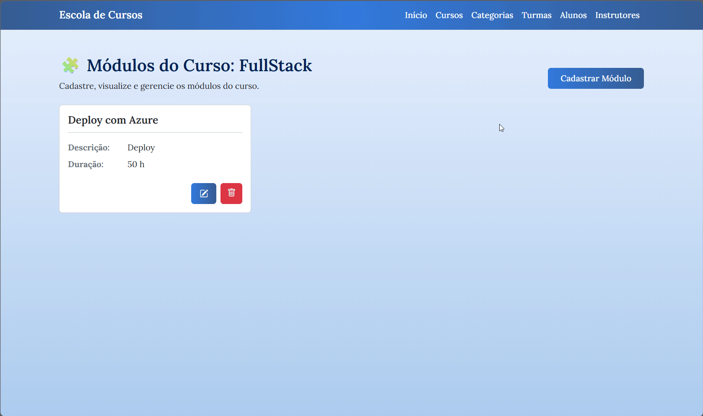
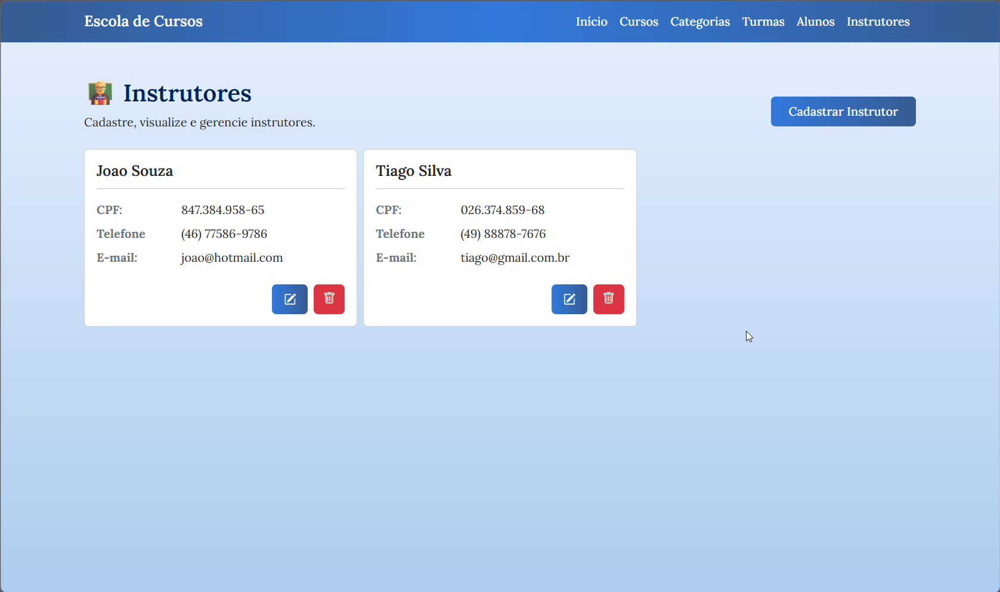
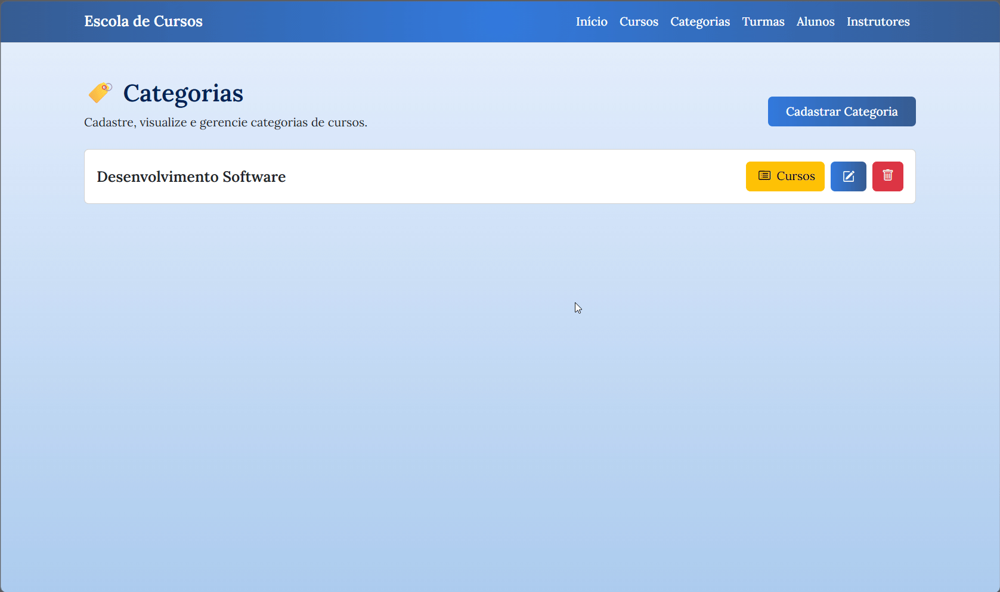
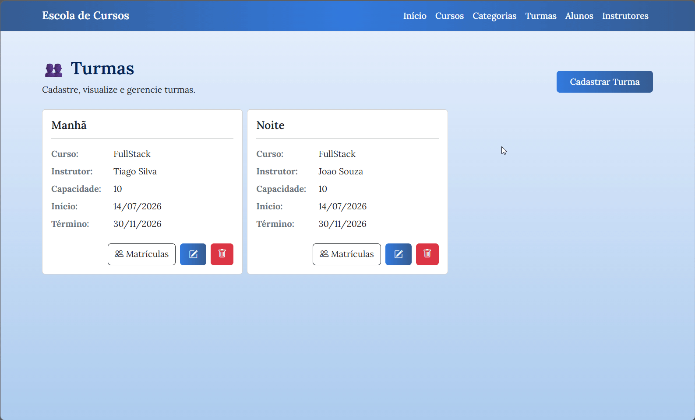
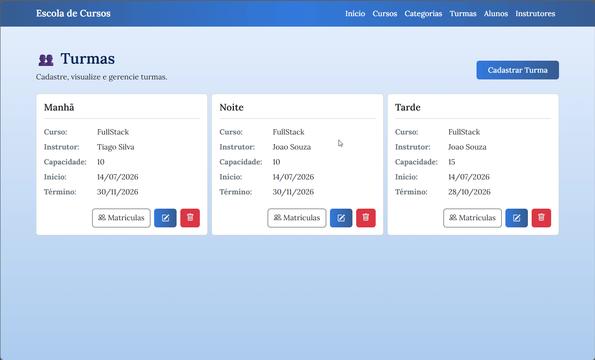
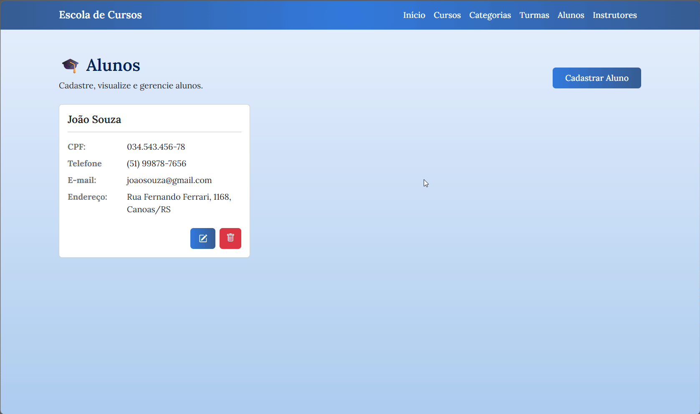

# 📒 Escola de Cursos  

- A Escola de Cursos é um sistema de gerenciamento acadêmico que reúne em um só lugar funcionalidades essenciais para organização de cursos, turmas, alunos, instrutores e matrículas.  

- O sistema garante consistência e confiabilidade dos dados com regras de negócio bem definidas.  

<p align="center">

</p>

## Funcionalidades  

### 📚 1. Módulo de Cursos  
<p align="center">

</p>

### Requisitos Funcionais
- O sistema deve permitir a inserção de novos cursos  
- O sistema deve permitir a edição de cursos já cadastrados  
- O sistema deve permitir excluir cursos já cadastrados  
- O sistema deve permitir visualizar cursos cadastrados

### Regras de Negócio 
- Campos obrigatórios:  
  - Título (2-100 caracteres)  
  - Descrição (2-100 caracteres)  
  - Categoria  
  - Nível (Baixo, Médio, Alto)  
  - Carga Horária  
  
> ** Todo curso pertence obrigatoriamente a uma categoria  
> ** A carga horária deve ser maior que zero  
> ** Um curso pode possuir diversas turmas e módulos  
> ** Não pode haver cursos com o mesmo nome  
> ** Não permitir excluir curso com turmas vinculadas  

---

### 1.1 Módulos do Curso (Aulas)  
<p align="center">

</p>

### Requisitos Funcionais
- O sistema deve permitir a inserção de novas aulas  
- O sistema deve permitir a edição de aulas já cadastradas  
- O sistema deve permitir excluir aulas já cadastradas  
- O sistema deve permitir visualizar aulas cadastradas

### Regras de Negócio  
- Campos obrigatórios:  
  - Título (2-100 caracteres)  
  - Descrição (2-100 caracteres)  
  - Curso  
  - Ordem  
  - Duração do Módulo  

> ** Exibir módulos em sequência lógica de aprendizado  
> ** Todo módulo pertence a um curso  
> ** A ordem do módulo dentro de um curso não pode se repetir  
> ** A duração deve ser maior que zero  

---

### 👨‍🏫 2. Módulo de Instrutores  
<p align="center">

</p>

### Requisitos Funcionais  
- O sistema deve permitir a inserção de novos instrutores  
- O sistema deve permitir a edição de instrutores já cadastrados  
- O sistema deve permitir excluir instrutores já cadastrados  
- O sistema deve permitir visualizar instrutores cadastrados

### Regras de Negócio  
- Campos obrigatórios:  
  - Nome (2-100 caracteres)  
  - CPF (11 dígitos)  
  - Telefone (formatos válidos)  
  - E-mail (formato válido)  

> ** Não pode haver instrutores com mesmo CPF ou e-mail  
> ** Não permitir excluir instrutor vinculado a alguma turma  

### 🏷️ 3. Módulo de Categorias 
<p align="center">

</p>

### Requisitos Funcionais  
- O sistema deve permitir a inserção de novas categorias  
- O sistema deve permitir a edição de categorias já cadastradas  
- O sistema deve permitir excluir categorias já cadastradas  
- O sistema deve permitir visualizar categorias cadastradas 

### Regras de Negócio   
- Campos obrigatórios:  
  - Título (2-100 caracteres)  
  - Cursos (cadastrados posteriormente)  

> ** Todo curso pertence a uma categoria  
> ** Visualizar cursos pertencentes a uma categoria específica 
> ** Não pode haver categorias com mesmo título  
> ** Não permitir excluir categorias relacionadas a cursos  

---

### 👥 4. Módulo de Turmas  

<p align="center">

</p>

### Requisitos Funcionais  
- Cadastrar novas turmas  
- Editar turmas existentes  
- Excluir turmas  
- Visualizar todas as turmas  

### Regras de Negócio   
- Campos obrigatórios:  
  - Nome (2-100 caracteres)  
  - Curso  
  - Instrutor  
  - Capacidade Máxima  
  - Data de início  
  - Data de término  

> ** Toda turma deve possuir exatamente um curso e um instrutor  
> ** Data de término deve ser posterior à data de início  
> ** Capacidade máxima deve ser maior que zero  
> ** Não permitir excluir turmas com alunos matriculados  

---

### 📝 5. Módulo de Matrículas  

<p align="center">

</p>

### Requisitos Funcionais
 
- Matricular alunos em turmas  
- Cancelar matrícula  
- Visualizar matrículas realizadas  

### Regras de Negócio   
- Campos obrigatórios:  
  - Aluno  
  - Turma  
  - Data  
  - Situação do Aluno  

> ** Matrícula é o vínculo entre aluno e turma  
> ** Somente alunos cadastrados podem ser matriculados  
> ** Somente turmas cadastradas podem receber matrículas  
> ** Um aluno não pode ser matriculado duas vezes na mesma turma  
> ** Não permitir matrículas acima da capacidade máxima da turma  

---

### 🎓 6. Módulo de Alunos  
<p align="center">

</p>

### Requisitos Funcionais
- Cadastrar novos alunos  
- Editar alunos existentes  
- Excluir alunos  
- Visualizar todos os alunos  

### Regras de Negócio  
- Campos obrigatórios:  
  - Nome (2-100 caracteres)  
  - CPF (11 dígitos)  
  - Telefone (formatos válidos)  
  - E-mail (formato válido)  
  - Endereço  

> ** O aluno pode participar de várias turmas ao longo do tempo  
> ** Não pode haver alunos com mesmo CPF ou e-mail  

---

## Como utilizar

1. Clone o repositório ou baixe o código fonte.
2. Abra o terminal ou prompt de comando e navegue até a pasta raiz.
3. Utilize o comando abaixo para restaurar as dependências do projeto:

    ```bash
   dotnet restore
   ```
4. Para executar o projeto compilando em tempo real

   ```bash
   dotnet run --project EscolaDeCursos.WebApp
   ```

## Requisitos

- .NET 10.0 SDK

## 👩‍💻 Colaboradores

1. Natália Bortoli Vieira - [@nataliavieirab](https://github.com/nataliavieirab)
2. Júlia Hartmann - [@JuliaaHartmann](https://github.com/JuliaaHartmann)
3. Revisado pela [Academia do Programador](https://academiadoprogramador.com.br)
